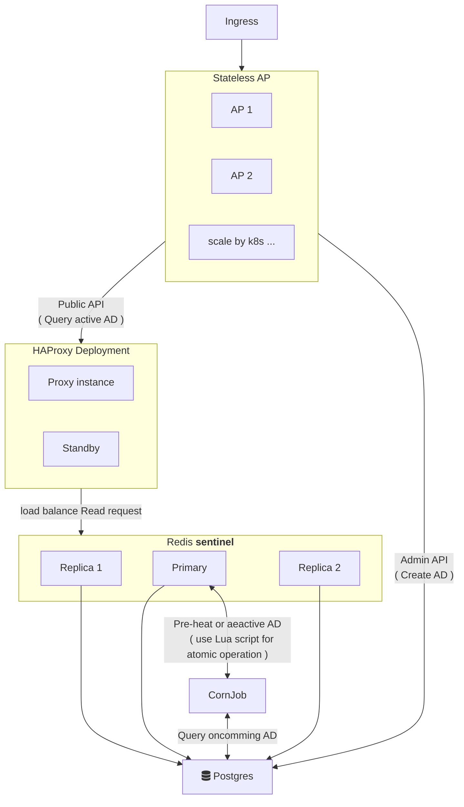

# Dcard Advertisement API
Dcard Backend Intern Assignment  2024 .  <br>
The assignment can be broadly defined as:  <br>
<pre> Developing a read-heavy API (1000 requests per second) for querying time-series data within specific intervals under multiple conditions. </pre>

## Table of Contents

- [System Architecture (系統架構圖)](#system-architecture)
- [System Design (系統設計＆思路)](#system-design)
    - [Data Hotspot](#data-hotspot)
    - [Estimated Data Size](#estimated-data-size)
    - [How to preheat & deactive ?](#how-to-preheat--deactive-)
- [Setup : Development](#setup--development)
- [Setup : Production ( kubernetes )](#setup--production--kubernetes)
- [Features : Optimize `Redis` with `Lua` script & config](#features--optimize-redis-with-lua-script--config)
- [Features : High availability with Redis Sentinel](#features--high-availability-with-redis-sentinel)
- [Features : Local Cache in Memory](#features--local-cache-in-memory)
- [DevOps : CI/CD](#devops--cicd)
- [Reference](#reference)

## TODO

> [Assignment Link](https://drive.google.com/file/d/1dnDiBDen7FrzOAJdKZMDJg479IC77_zT/view)

- [ ] 請對這兩組 API 進行合理的參數驗證和錯誤處理
- [ ] 請撰寫適當的 test
- [ ] 提供 Public API 能超過 10,000 Requests Per Second 的設計
- [ ] 同時存在系統的總活躍廣告數量 (也就是 StartAt < NOW < EndAt) < 1000
- [ ] 每天 create 的廣告數量 不會超過 3000 個
- [ ] 請在 Readme 中描述想法和設計上的選擇

## Evaluation

- 正確性: 必須符合基本要求、功能能正常運作
- 效能: 選擇的設計與實作是否符合或者超過上述提到的效能需求
- 可讀性: 程式碼可讀性、註解、Readme 說明
- 測試: 是否有適當完整的 unit test

## Problem Statement

### API 1: Create Advertisement

Example:

```bash
curl -X POST -H "Content-Type: application/json" \
"http://<host>/api/v1/ad" \
--data '{
    "title" "AD 55",
    "startAt" "2023-12-10T03:00:00.000Z",
    "endAt" "2023-12-31T16:00:00.000Z",
    "conditions": {
        {
            "ageStart": 20,
            "ageEnd": 30,
            "country: ["TW", "JP"],
            "platform": ["android", "ios"]
        }
    }
}'
```

### API 2: Query Advertisement

```bash
curl -X GET -H "Content-Type: application/json" \
"http://<host>/api/v1/ad?offset=10&limit=3&age=24&gender=F&country=TW&platform=ios"
```

```json
// response
{
    "items": [
        {
            "title": "AD 1",
            "endAt" "2023-12-22T01:00:00.000Z"
        },
        {
            "title": "AD 31",
            "endAt" "2023-12-30T12:00:00.000Z"
        },
        {
            "title": "AD 10",
            "endAt" "2023-12-31T16:00:00.000Z"
        }
    ]
}
```

### Questions ?

當時我有 2 個不清楚的地方：

**Q1 :** <br>
> 想請問 「投放 API」查詢參數的 「Age、Gender、Country、Platform 」<br>
> 會需要考慮參數各有多個查詢條件 嗎？ <br>
>
> 如：條件為 `16 <= Age <= 20 && ( Country == TW || Country == JP )` <br>
> API : `http://<host>/api/v1/ad?offset=10&limit=3&age=[16,20]&gender=F&country=[TW,JP]&platform=ios` <br>
> 還是只需要考慮範例所示的，查詢參數都各只有一個條件： <br>
> API : http://<host>/api/v1/ad?offset=10&limit=3&age=24&gender=F&country=TW&platform=ios

**A1 :** <br>
投放時，個人的 age, country 都是固定的，只會有單一一個

<br>

**Q2 :**
> 還想請問 「投放 API」如果沒有指定所有參數 <br>
> 如： 沒有指定 Age 和 Platform <br>
> API : http://<host>/api/v1/ad?offset=10&limit=3&gender=F&country=TW

**A2 :** <br>
第一個理解是正確的，沒有設定的部分，就是 wildcard 唷


## System Architecture




## System Design

要達到 : <br>
- **1000 requests per second** 
- **總活躍廣告數量 < 1000**
- 當天至多 Create 3000 個廣告

所以是一個 **read-heavy** 的 API，這邊不會著重在 Create Advertisement <br>
主要著重在如何設計有效率的 Query Advertisement 解法 <br>

核心的想法是: <br>
透過 **Corn Job** 來定期的
把 **最常出現的查詢條件** (data hotspot) 都 **preheat** 到 Redis 中 <br>
同樣也透過 Corn Job 來將 **過期的資料** 刪除 <br>

### Data Hotspot

**Age** <br>
根據：
- [Dcard News 描述](https://about.dcard.tw/news/25)
    > Dcard 站上有超過八成的「卡友」（意指 Dcard 站上的用戶）介於 18 - 35 歲年齡區段
- [similarweb.com 對 Dcard 網站流量分析](https://www.similarweb.com/zh-tw/website/dcard.tw/#demographics)
    > 25 - 34 歲的訪客占最多數。 （電腦上）

可以假設 `[ 18 , 35+5 ]` 的年齡的熱點區間 <br>
( 因為 Dcard 要滿 18 才能註冊，所以只對多數用戶年齡的上界做 +5 ) <br>

**Country** <br>
根據： [Dcard 官網 - 徵才介紹](https://about.dcard.tw/career)
> 拓展範圍擴及台灣、香港、日本以及其他海外市場

先假設目前 Country 的熱點有 **5** 個 <br>
( 這邊沒有特別去查 Dcard 的流量分析，所以先假設 5 個 ) <br>
> 以 **`TW, HK, JP, US, KR`** 作為 Country Enum <br>

### Estimated Data Size

根據 [Data Hotspot](#data-hotspot) 的假設 <br>
- **Age** : 35 - 18 + 5 = 22
- **Country** : 5 
- **Platform** : 3 
- **Gender** : 2 

總共有 `22 * 5 * 3 * 2 = 660` 種熱點搜尋組合 <br>
並對每個組合都以 `ad:Age:Country:Platform:Gender` 做為 Key 的 **ZSET** <br>
來存所有符合這個組合的 SQL result <br>
ZSET 的結構如下 : <br>
- Field : stringfy 的 `title, endAt` ( 視情況看需不需要壓縮 )
- Score :  依照 SQL result 的順序 （ 1,2,3 ... ）<br> 在 pagnation 查詢時，可以直接用 `ZRANGE` 以 `O(logN)+M` 的時間複雜度取出 
- **TTL** : **設無限** ! <br> 因為這些都是熱點資料，為了防止**快取雪崩** 不設定 TTL<br> 並使用 Lua Script 來做 **Atomic 更新** <br>

### Not Hotspot Data

對於不是熱點的查詢條件，設置較短的 **TTL** <br>
如：15 分鐘 <br>

### How to preheat & deactive ?

題目的要求有特別提到 : <br>
- **總活躍廣告數量 < 1000**
- **每天 create 的廣告數量 不會超過 3000 個**

代表當下 SQL Create 的廣告 **不一定** 會立即 **活躍** <br>
> 最差的情況是當下 Create 的廣告都是未來的時間 <br>
> 如果在 SQL Create 的當下就直接 Preheat 到 Redis 中 <br>
> 反而會造成 Memory 的浪費 <br>

所以可以透過 **Corn Job** 來定期的更新 cache <br>
如：<br>
每 5 分鐘枚舉過所有 Hotspot 的排列組合 <br>
`select` 當前活躍的廣告列表，並加入到 `Redis` 的 `ZSET` 中 <br>

---

> 當時想了一些其他的 [Solution]() <br>
> 一開始都卡在 `Age` 這個欄位要如何有效搜尋或是儲存 <br>
> 最後選擇目前的 preheat data hotpots 做實作 <br>

## Setup : Development

### Prerequisites

- `air` : Hot reload for Go
- `swag` : auto generate API doc
- `make` : Build tool

### Setup

```bash
```

## Setup : Production ( kubernetes )


## Features : Distributed Locks with Redis 

Hotspot Invalid ( 快取擊穿 ) <br>

## Features : Local Cache in Memory

https://github.com/chenyahui/gin-cache

除了在 Redis 做 Cache ， 也可以在 Local Memory 做 Cache <br>
但是會設定更短的 TTL <br>

## Features : High availability with Redis Sentinel

現在我們的 API 對 Redis 有很高的依賴 <br>
如果 Redis instance 掛掉，整個 DB 也會被流量打掛 <br>
所以要保證 Redis 的高可用性 <br>

這邊可以透過 Redis Sentinel ( 哨兵模式 ) 來達成 <br>
並且可以將 Query 操作分散到多個 Redis instance 上 <br>

## DevOps : CI/CD

## Reference