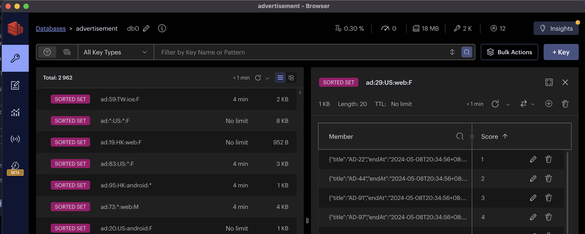

# Dcard Advertisement API
Dcard Backend Intern Assignment  2024 .  <br>
The assignment can be broadly defined as:  <br>
<pre> Developing a read-heavy API (1000 requests per second) for querying time-series data within specific intervals under multiple conditions. </pre>

## Benchmark Summary

- **Local** : MacBook Air (M1, 2020), 16GB RAM
    - `13830.616806/s`
- **GKE** : Google Kubernetes Engine, **Autopilot** mode, asia-east1
    - `456.225066/s` (old version code)
- **GCE** : Google Compute Engine, **e2-standard-4** (4 vCPUs, 16 GB memory), asia-east1
    - `3233.865472/s` (old version code)

## Table of Contents

* [Dcard Advertisement API](#dcard-advertisement-api)
   * [Benchmark Summary](#benchmark-summary)
   * [Table of Contents](#table-of-contents)
   * [TODO](#todo)
   * [Problem Statement](#problem-statement)
      * [API 1: Create Advertisement](#api-1-create-advertisement)
      * [API 2: Query Advertisement](#api-2-query-advertisement)
   * [System Architecture](#system-architecture)
      * [Ideal Architecture](#ideal-architecture)
      * [Finial implimentation](#finial-implimentation)
   * [System Design](#system-design)
      * [Core Concept](#core-concept)
      * [Data Hotspot](#data-hotspot)
      * [Estimated Data Size](#estimated-data-size)
      * [Redis Cache](#redis-cache)
         * [Implementation Details](#implementation-details)
      * [How to refresh Local Cache ?](#how-to-refresh-local-cache-)
         * [Implementation Details](#implementation-details-1)
      * [Not fast enough ? Cache by URI](#not-fast-enough--cache-by-uri)
         * [Pros &amp; Cons](#pros--cons)
   * [Problem I faced](#problem-i-faced)
      * [Redis Sentinel: return docker container IP](#redis-sentinel-return-docker-container-ip)
      * [GKE: cross node network latency](#gke-cross-node-network-latency)
      * [How to cache all data ?](#how-to-cache-all-data-)
   * [Setup : Local Development](#setup--local-development)
   * [Setup : Production ( kubernetes )](#setup--production--kubernetes-)
   * [Project Structure](#project-structure)
   * [DevOps : CI/CD](#devops--cicd)
   * [Test](#test)
   * [Benchmark](#benchmark)
         * [Pros &amp; Cons](#pros--cons-1)
      * [How to stimulate the real world data ?](#how-to-stimulate-the-real-world-data-)
      * [Redis Cache + Local Cache + PG Primary Replica + Refactor Models + Cache by URI](#redis-cache--local-cache--pg-primary-replica--refactor-models--cache-by-uri)
         * [Local, warm, 5min: 13830.616806/s, avg=22.8ms, min=33µs med=888µs max=633.52ms p(90)=78.12ms p(95)=130.47ms](#local-warm-5min-13830616806s-avg228ms-min33µs-med888µs-max63352ms-p907812ms-p9513047ms)
         * [Local, cold, 5min: 9671.775515/s, avg=1.35ms  min=16µs     med=76µs max=211.2ms  p(90)=2.06ms p(95)=6.52ms](#local-cold-5min-9671775515s-avg135ms--min16µs-----med76µs-max2112ms--p90206ms-p95652ms)
      * [Redis Cache + Local Cache + PG Primary Replica + Cache by URI (gin-cache)](#redis-cache--local-cache--pg-primary-replica--cache-by-uri-gin-cache)
         * [Local, 1min: 9459.201983/s, avg=16.33ms  min=38µs    med=1.23ms max=675.93ms p(90)=41.4ms  p(95)=81.1ms](#local-1min-9459201983s-avg1633ms--min38µs----med123ms-max67593ms-p90414ms--p95811ms)
         * [Local, 5min: 9514.610584/s, avg=29ms  min=48µs med=5.59ms max=1.02s p(90)=86.08ms p(95)=127.92ms](#local-5min-9514610584s-avg29ms--min48µs-med559ms-max102s-p908608ms-p9512792ms)
      * [Redis Cache + Local Cache + PG Primary Replica](#redis-cache--local-cache--pg-primary-replica)
         * [Local, 1min: 9501.859952/s, avg=11.42ms  min=35µs med=416µs max=815.36ms p(90)=24.99ms p(95)=50.21ms](#local-1min-9501859952s-avg1142ms--min35µs-med416µs-max81536ms-p902499ms-p955021ms)
         * [Local, 5min: 9514.610584/s, avg=29ms  min=48µs med=5.59ms max=1.02s p(90)=86.08ms p(95)=127.92ms](#local-5min-9514610584s-avg29ms--min48µs-med559ms-max102s-p908608ms-p9512792ms-1)
      * [Redis Cache + Local Cache (fastcache)](#redis-cache--local-cache-fastcache)
         * [Local, 1min: 8301.942698/s, avg=161.89ms min=48µs med=1.8ms max=2.23s p(90)=515.98ms p(95)=640.42ms](#local-1min-8301942698s-avg16189ms-min48µs-med18ms-max223s-p9051598ms-p9564042ms)
         * [Local, 5min: 8752.0529/s, avg=106.3ms min=46µs med=22.19ms max=3.1s p(90)=300.38ms p(95)=457.64ms](#local-5min-87520529s-avg1063ms-min46µs-med2219ms-max31s-p9030038ms-p9545764ms)
         * [GKE, 1min, 2 replica API: 360.246923/s, avg=281.82ms min=667.31µs med=199.68ms max=2.45s p(90)=666.89ms p(95)=806.6ms](#gke-1min-2-replica-api-360246923s-avg28182ms-min66731µs-med19968ms-max245s-p9066689ms-p958066ms)
         * [GKE, 5min, 2 replica API: 440.694654/s, avg=816.11ms min=740.72µs med=601.35ms max=6.62s p(90)=1.79s    p(95)=2.37s](#gke-5min-2-replica-api-440694654s-avg81611ms-min74072µs-med60135ms-max662s-p90179s----p95237s)
         * [GKE, 5min, 5 replica API: 456.225066/s,avg=821.86ms min=651.89µs med=607.26ms max=4.99s p(90)=1.78s    p(95)=2.4s](#gke-5min-5-replica-api-456225066savg82186ms-min65189µs-med60726ms-max499s-p90178s----p9524s)
         * [GCE, 1min: 3233.865472/s, avg=1.2s     min=248.72µs med=976.16ms max=13.11s   p(90)=2.7s     p(95)=3.25s](#gce-1min-3233865472s-avg12s-----min24872µs-med97616ms-max1311s---p9027s-----p95325s)
         * [GCE, 5min: 3043.105727/s, avg=1.89s   min=539.18µs med=1.8s    max=15.41s   p(90)=2.67s    p(95)=2.92s](#gce-5min-3043105727s-avg189s---min53918µs-med18s----max1541s---p90267s----p95292s)
      * [Redis Cache](#redis-cache-1)
         * [Local, 1min: 6695.510836/s, avg=444.3ms  min=306µs med=419.89ms max=1.03s   p(90)=693.87ms p(95)=756.54ms](#local-1min-6695510836s-avg4443ms--min306µs-med41989ms-max103s---p9069387ms-p9575654ms)
         * [Local, 5min: 7798.832707/s, avg=268.63ms min=51µs med=1.63ms max=2.39s    p(90)=957.71ms p(95)=1.16s](#local-5min-7798832707s-avg26863ms-min51µs-med163ms-max239s----p9095771ms-p95116s)
      * [More benchmark records](#more-benchmark-records)

## TODO

> [Assignment Link](https://drive.google.com/file/d/1dnDiBDen7FrzOAJdKZMDJg479IC77_zT/view)
- [x] 請對這兩組 API 進行合理的參數驗證和錯誤處理
- [x] 請撰寫適當的 test
- [x] 提供 Public API 能超過 10,000 Requests Per Second 的設計
- [x] 同時存在系統的總活躍廣告數量 (也就是 StartAt < NOW < EndAt) < 1000

## Problem Statement

### API 1: Create Advertisement

Example:

```bash
curl -X POST -H "Content-Type: application/json" \
"http://<host>/api/v1/ad" \
--data '{
    "title" "AD 55",
    "startAt" "2023-12-10T03:00:00.000Z",
    "endAt" "2023-12-31T16:00:00.000Z",
    "conditions": {
        {
            "ageStart": 20,
            "ageEnd": 30,
            "country: ["TW", "JP"],
            "platform": ["android", "ios"]
        }
    }
}'
```

### API 2: Query Advertisement

```bash
curl -X GET -H "Content-Type: application/json" \
"http://<host>/api/v1/ad?offset=10&limit=3&age=24&gender=F&country=TW&platform=ios"
# if not specified, the default query condition is wildcard !!!
```

```json
{
    "items": [
        {
            "title": "AD 1",
            "endAt" "2023-12-22T01:00:00.000Z"
        },
        {
            "title": "AD 31",
            "endAt" "2023-12-30T12:00:00.000Z"
        },
        {
            "title": "AD 10",
            "endAt" "2023-12-31T16:00:00.000Z"
        }
    ]
}
```

## System Architecture

### Ideal Architecture

原本在 Redis Cache 的部分是想要用 **Redis Sentinel** 的架構 <br>
- 來達到 **High Availability** 和 **Read Scalability** 的目的


### Finial implimentation


## System Design

### Core Concept

要達到 : <br>
- **1000 requests per second** 
- **總活躍廣告數量 < 1000**
- 當天至多 Create 3000 個廣告

所以是一個 **read-heavy** 的 API，這邊不會著重在 Create Advertisement <br>
主要著重在如何設計有效率的 Query Advertisement 解法 <br>

核心的想法是: <br>
透過 **Corn Job** 來定期的
把 **最常出現的查詢條件** (data hotspot) 都排列組合出來後 <br>
並且把這些組合的 SQL result 都更新到 **Redis** 和 **Local Cache** 中 <br>

對於 Local Cache 也有另外的 **Background Goroutine** 來定期的更新 Cache <br>

### Data Hotspot

**Age** <br>
根據：
- [Dcard News 描述](https://about.dcard.tw/news/25)
    > Dcard 站上有超過八成的「卡友」（意指 Dcard 站上的用戶）介於 18 - 35 歲年齡區段
- [similarweb.com 對 Dcard 網站流量分析](https://www.similarweb.com/zh-tw/website/dcard.tw/#demographics)
    > 25 - 34 歲的訪客占最多數。 （電腦上）

可以假設 `[ 18 , 35 ]` 的年齡的熱點區間 <br>
( 因為 Dcard 要滿 18 才能註冊，所以只對多數用戶年齡的上界做 ) <br>

**Country** <br>
根據： [Dcard 官網 - 徵才介紹](https://about.dcard.tw/career)
> 拓展範圍擴及台灣、香港、日本以及其他海外市場

先假設目前 Country 的熱點有 **5** 個 <br>
( 這邊沒有特別去查 Dcard 的流量分析，所以先假設 5 個 ) <br>
> 以 **`TW, HK, JP, US, KR`** 作為 Country Enum <br>

### Estimated Data Size

根據 [Data Hotspot](#data-hotspot) 的假設 <br>
- **Age** : 35 - 18 + 1 = 18
- **Country** : 5 + 1 = 6
- **Platform** : 3 + 1 = 4
- **Gender** : 2 + 1 = 3
> 需要 +1 是因為有 **wildcard** 的情況 <br>

總共有 `18 * 6 * 4 * 3 = 1296` 種組合 <br>
在 Redis 中約為 15 MB <br>


### Redis Cache

當下 SQL Create 的廣告 **不一定** 會立即 **活躍** <br>
> 最差的情況是當下 Create 的廣告都是未來的時間 <br>
> 如果在 SQL Create 的當下就直接 Preheat 到 Redis 中 <br>
> 反而會造成 Memory 的浪費 <br>

<br>

可以透過 **Corn Job** 來定期的更新 cache <br>
每 M 分鐘枚舉過所有 Hotspot 的排列組合
>  M 為可依實際運行狀況 fine tune 的時間 <br>
> 設定為不影響實際 DB, Redis 的 Interval <br>
> 並且可接受的短暫資料不一致時間 <br>

<br>

從 DB SELECT 當前活躍的廣告列表，並加入到 `Redis` 的 `ZSET` 中 <br>
雖然會有短暫的資料不一致，但可以避免 **快取雪崩** 的問題和 **突發 preheat** 的問題 <br>
> 如： 同時有多個廣告在同一個時間點活躍 <br>
> 會造成 **大量的 Redis 更新** Block 住 <br>
> 使用 **Corn Job** 可以 **平均分散**這些更新 <br>


#### Implementation Details

`ZSET` 的結構如下 : <br>
- `Key` : `ad:age:country:platform:gender` <br>
    - 如果沒有特定條件，就用 `*` 代替 <br>
    - 例如：
        - `ad:18:TW:android:M` : 代表 18, TW, android, M 的 Advertisement List
        - `ad:18:TW:android:*` : 代表 18, TW, android, 不指定性別 的 Advertisement List
        - `ad:18:TW:*:*`   : 代表 18, TW, 不指定平台, 不指定性別 的 Advertisement List
        - `ad:18:*:*:*`    : 代表 18, 不指定國家, 不指定平台, 不指定性別 的 Advertisement List
        - `ad:*:*:*:*` : 代表所有的 Advertisement List
- `Field` : stringfy 的 title, endAt ( 視情況看需不需要壓縮 )
- `Score` : 依照 SQL result 的順序 （ 1,2,3 ... ）
    - 在 pagnation 查詢時，可以直接用 `ZRANGEBYSCORE` 以 `O(logN)+M` 的時間複雜度取出

<br>

- schduler 以 **Lua Script** 來做 **Atomic 更新** <br>
- **Hotdata** 的 **TTL** 應該要設為
    - 比 **Schedule** 下次更新的時間還要長 <br>
    - 這樣可以確保 **Hotdata** 不會在 **Schedule** 更新前被刪除 <br>
    - 並且可以避免 **快取雪崩** 的問題 <br>
- **Colddata** 的 **TTL** 應該要設為相對較短的時間 <br>
    - 不會佔用太多的 Memory 和 Key 導致 Redis 的效能下降 <br>


### How to refresh Local Cache ?

一開始想到 Local Cache 的設計是 : 
在 Local 存一份與 Redis 相似的 key-value 結構 <br>
- `Key` : 同樣為 `ad:age:country:platform:gender` <br>
- `Value` : 則是以 `[]byte` 的形式存入 <br>
    - 這樣可以直接用 `json.Unmarshal` 來轉換成 struct <br>
    - 所以剛好可以使用 `fastcache` 來實作 ! <br>
    - 也可以順便 cache 其他不屬於 Hotspot 的資料 <br>

但在實作時想到 : <br>
- 如果 Redis 的 Cache 更新了，但 Local Cache 沒有更新 <br>
- 也會造成 **Local Cache 的資料不一致** <br>

所以需要一個 **Background Goroutine** 來定期的更新 Local Cache <br>

#### Implementation Details

與更新 **Redis Cache** 的 **Corn Job** 類似 <br>
同樣定期更新 **Hotspot** 的資料 <br>
- 當時的實作是直接往 DB 查詢，然後更新 Local Cache <br>
    - 這樣可以確保 Local Cache 的資料是最新的 <br>
    - 但發現直接往 DB 查詢會造成 **DB 的負擔** 過重 <br>
    - 所以還是改成往 Redis 查詢，然後更新 Local Cache <br>

### Not fast enough ? Cache by URI

在 Local Cache 存與 Redis 相同的 key-value 結構後 <br>
還是不能在 Local 達到 **10000 RPS** 的要求 <br>

所以可以透過 **gin-cache** 來實作 <br>
- 透過 **gin-cache** 來直接 cache **URI** 的 response <br>
- 可以看成為 **Local Cache** 再多加上一層 **URI Cache** <br>
    - 如果 **URI Cache** 有命中，就直接回傳 **Response** <br>

#### Pros & Cons
- Pros
    最後加上 **Local Cache** 和 **URI Cache** 的設計 <br>
    在 Local 可以達到 **10000 RPS** 的要求 <br>
    > 13830.616806/s !
- Cons
    - **Cache by URI** 的設計比單純的 **Local Cache** 多了一倍的 **Memory** 使用量 <br>
        - 單純只有 **Local Cache** 在 benchmark 時約使用 **500 MB** 的 Memory <br>
        - 加上 **Cache by URI** 後約使用 **700 ~ 700 MB** 的 Memory <br>

## Problem I faced

### Redis Sentinel: return docker container IP

在 Local 開發時，使用 **Docker** 來跑 **Redis Sentinel** <br>
有在 [feature/redis-sentinel](https://github.com/jason810496/Dcard-Advertisement-API/tree/feature/redis-sentinel) branch 設定好 Redis Sentinel <br>

但在 **Redis Sentinel** 的 **Master** 和 **Replica** 都是回傳 **Docker Container IP** <br>
- 這樣會造成 **Golang** 連接 **Redis** 時，無法連接到 **Redis Sentinel** <br>

<br>

目前想到的解法是 : <br>
直接使用 helm chart 來部署 Bitnami **Redis Sentinel** <br>

### GKE: cross node network latency

在 Redis + Local Cache 版本的 benchmark 時 <br>
發現在 **GKE** 上的 **QPS** 遠比 **Local** 和 **GCE** 低! <br>

查看 pod 被分配到的 node 發現 : 所有的 pod 被分配到 **3 個不同的 node** <br>
```
NAME                                        STATUS   ROLES    AGE    VERSION
gk3-dcard-ad-cluster-pool-2-1029589d-5xq7   Ready    <none>   98m    v1.27.8-gke.1067004
gk3-dcard-ad-cluster-pool-2-1029589d-cwjj   Ready    <none>   17m    v1.27.8-gke.1067004
gk3-dcard-ad-cluster-pool-2-2fbad26e-hj69   Ready    <none>   144m   v1.27.8-gke.1067004
gk3-dcard-ad-cluster-pool-2-368b8fc3-7g5l   Ready    <none>   144m   v1.27.8-gke.1067004
NAME                                   STATUS      NODE
database-statefulset-0                 Running     gk3-dcard-ad-cluster-pool-2-1029589d-5xq7
redis-statefulset-0                    Running     gk3-dcard-ad-cluster-pool-2-1029589d-5xq7
api-deployment-5fcb7fcb7d-pnlsb        Running     gk3-dcard-ad-cluster-pool-2-1029589d-cwjj
api-deployment-5fcb7fcb7d-czpf6        Running     gk3-dcard-ad-cluster-pool-2-2fbad26e-hj69
k6-deployment-648bfd955f-n6zc4         Running     gk3-dcard-ad-cluster-pool-2-2fbad26e-hj69
api-deployment-5fcb7fcb7d-zqmhw        Running     gk3-dcard-ad-cluster-pool-2-368b8fc3-7g5l
scheduler-deployment-599db6dc6-nj6kt   Running     gk3-dcard-ad-cluster-pool-2-368b8fc3-7g5l
generator-pod                          Succeeded   gk3-dcard-ad-cluster-pool-2-2fbad26e-hj69
```
<br>

以不同的 API replica 數量部署，比較在 Benchmark 時的 **QPS** 和 **CPU,RAM** 使用量 <br>
- **2 replica API**
    ```
    NAME                              CPU(cores)   MEMORY(bytes)
    api-deployment-5fcb7fcb7d-czpf6   127m         79Mi
    NAME                              CPU(cores)   MEMORY(bytes)
    api-deployment-5fcb7fcb7d-zqmhw   123m         75Mi
    NAME                  CPU(cores)   MEMORY(bytes)
    redis-statefulset-0   42m          9Mi
    NAME                     CPU(cores)   MEMORY(bytes)
    database-statefulset-0   46m          46Mi
    ```
- **3 replica API**
    ```
    ❯ ./scripts/status.sh top
    NAME                              CPU(cores)   MEMORY(bytes)
    api-deployment-5fcb7fcb7d-czpf6   81m          73Mi
    NAME                              CPU(cores)   MEMORY(bytes)
    api-deployment-5fcb7fcb7d-pnlsb   72m          57Mi
    NAME                              CPU(cores)   MEMORY(bytes)
    api-deployment-5fcb7fcb7d-zqmhw   82m          72Mi
    NAME                     CPU(cores)   MEMORY(bytes)
    database-statefulset-0   49m          56Mi
    NAME                  CPU(cores)   MEMORY(bytes)
    redis-statefulset-0   50m          10Mi
    ```
- **5 replica API**
    ```
    NAME                              CPU(cores)   MEMORY(bytes)
    api-deployment-5fcb7fcb7d-44ndl   45m          44Mi
    NAME                              CPU(cores)   MEMORY(bytes)
    api-deployment-5fcb7fcb7d-czpf6   55m          67Mi
    NAME                              CPU(cores)   MEMORY(bytes)
    api-deployment-5fcb7fcb7d-g9wxc   60m          45Mi
    NAME                              CPU(cores)   MEMORY(bytes)
    api-deployment-5fcb7fcb7d-pnlsb   45m          52Mi
    NAME                              CPU(cores)   MEMORY(bytes)
    api-deployment-5fcb7fcb7d-zqmhw   57m          64Mi
    NAME                     CPU(cores)   MEMORY(bytes)
    database-statefulset-0   52m          101Mi
    NAME                  CPU(cores)   MEMORY(bytes)
    redis-statefulset-0   40m          10Mi
    ```

可以看到 API replica 數量增加時 <br>
QPR 與 DB 和 Redis 的 CPU,RAM 使用量沒有明顯增加 <br>

所以可以推測是 **cross node network latency** 的問題 <br>

### How to cache all data ?

最一開始在規劃 Cache 時 <br>
卡在 **要如何將所有資料都 cache 到 Redis 中並有效率的查詢** <br>
> 以 age 的範圍是 1 ~ 100 來說 <br>
> 所有的組合有 100 * 6 * 4 * 3 = 7200 種 <br>
> 如果每個組合都要 cache 到 Redis 中 <br>
> 會造成 **Memory** 的浪費和 **查詢效率** 的下降 <br>

<br>

但多次思考後發現 : <br>
- 並不需要把所有資料都 cache 到 Redis 中 <br>
- 只需要把 **Hotspot** 的資料 cache 到 Redis 中 <br>
- 並著重在
    - 如何讓系統在穩定的狀態下，定期的更新 **Hotspot** 的資料 <br>
    - 有效率的查詢 Cache 過的資料 <br>


## Setup : Local Development

- Prerequisites
    - `air` : Hot reload for Go
    - `swag` : auto generate API doc
    - `make` : Build tool
    - `docker compose` : For DB and Redis
- `Redis`
    ```
    docker compose up redis -d
    ```
- `Postgres` : Primary Replica setup
    ```bash
    make local-primary-replica-reset
    make local-primary-replica-setup # should enter `replpass`
    make local-primary-replica-test
    ```
- api
    ```bash
    go mod download
    cp .env/dev/local.template.yaml .env/dev/local.yaml
    make build-api
    ./bin/api -config local 
    ```
- 設定檔都在
    - `.env/*.yaml`
    - `.env/dev/*.env`
- 如果要切換不同設定檔，可以透過 `-config` flag 來指定
    ```bash
    ./bin/api -config prod # use .env/prod.yaml
    ./bin/api -config kubernetes # use .env/dev/kubernetes.yaml
    ```

## Setup : Production ( kubernetes )

> ![Note]
> 這邊只有設定好至 **Redis + Local Cache** 的版本 <br>
> 所以需要先 `git checkout release/v2` 才能使用 <br>

```bash
make kube-config
make gke-database
make gke-redis
make gke-generator
make gke-api
make gke-scheduler
```

## Project Structure

```bash
.
├── .env # Environment Variables and Config
│   ├── dev
│   │   ├── db.template.env
│   │   ├── k6-operator.env
│   │   ├── k6-operator.template.env
│   │   ├── k6.template.env
│   │   └── redis.template.env
│   ├── kubernetes
│   │   ├── k6-grafana-cloud-prometheus.env
│   │   ├── k6-grafana-cloud-prometheus.template.env
│   │   ├── k6-grafana-cloud-secret.env
│   │   └── k6-grafana-cloud-secret.template.env
│   ├── dev.template.yaml
│   ├── kubernetes.template.yaml
│   ├── local.template.yaml
│   ├── prod.template.yaml
│   └── test.template.yaml
├── .github # Github Actions
├── Makefile
├── README.md
├── bin # binary
├── cmd # main entry
├── deployments 
├── docker-compose-benchmark.yaml
├── docker-compose-pg-primary-replica.yaml
├── docker-compose-scale.yaml
├── docker-compose.yaml
├── docs # swagger doc
├── go.mod
├── go.sum
├── infra # terraform for GKE
├── k6
│   └── load-test.js
├── pkg # main code
│   ├── cache
│   ├── config
│   ├── const
│   ├── database
│   ├── handlers
│   ├── middleware
│   ├── models
│   ├── scheduler
│   ├── schemas
│   ├── services
│   └── utils
├── scripts # shell scripts for kubectl utils and PG primary replica setup
└── test # test code
    └── api # api test
        ├── helper.go
        ├── main_test.go
        ├── service_test.go
        └── validate_test.go
```
## DevOps : CI/CD

因為時間關係，主要只有完成 CI 的部分 <br>
使用 **Github Actions** 來做 CI <br>

<br>

在 push 或 PR 到 **build** branch 時 <br>
會自動 build Image 並 push 到 **Docker Hub** <br> 

## Test

主要分為 3 個部分的測試 : <br>
- validate test
    - 驗證 API 的輸入是否合法
- service test
    - 驗證 Local Cache 和 Redis Cache 與 DB 的一致性
- system test
    - 驗證整個系統使用 Redis Cache 和 Local Cache 的效能
    - 但因為時間問題，沒有完成 system test
> 這邊只有寫 API 的 test ， 但 Scheduler 的 Test 還沒有完成 <br>

<br>

使用 `setup` 和 `teardown` 來做測試前的準備和測試後的清理 <br>
如 [./test/service_test.go](./test/api/service_test.go) 中的 `TestService` <br>

```go
func TestServiceGetAdFromDB(t *testing.T) {
	SetupFunction(t, ClearDB, GenerateAds)
	defer TeardownFunction(t)

    // test code
```

## Benchmark

主要分為 3 個測試環境與 3 個測試方法 <br>
都是使用 [k6](https://k6.io/) 來做 load testing <br>

環境分為 : <br>
- **Local** : MacBook Air (M1, 2020), 16GB RAM
- **GKE** : Google Kubernetes Engine, **Autopilot** mode, asia-east1
    - 使用 `Terraform` 來部署( 只有在 benchmark 時才會開啟，用完就關掉 )
- **GCE** : Google Compute Engine, **e2-standard-4** (4 vCPUs, 16 GB memory), asia-east1

測試方法分為 : <br>
- 在 k8s 環境：
    - **k6-operator** : 使用 k6-operator 來在 k8s 上部署 k6 instance 來做 distributed load testing
    - **k6-deployment** : 在 k8s 上部署單個 k6 instance 來做 load testing
- 在 Local 與 GCE 環境：
    - **k6-local** : 在 local 直接下載 k6 來做 load testing

### `k6-operator` CRD

`k6-operator` 是一個可以在 k8s 上以 k6 做 load testing 的 CRD <br>
>
> 圖上的 `k6-sample-1` 和 `k6-sample-2` 是由 `k6-operator` 產生的 k6 instance <br>
> ( `parallelsim` 設為 2 ) <br>

#### Pros & Cons
- **Pros**
    - 提供 `parallelsim` 把 rate 平均分散給 N 個 k6 instance
        - 可以降低單一個 k6 instance CPU 飆高的問題
        - 在 k8s cluster 內執行 distributed load testing
    - 可以設定 prometheus 的 Remote Write Endpoint 來收集資料到 Grafana Cloud
    - 使用 configmap 來設定 k6 的 script
- **Cons**
    - k6-operator 在 apply resource 需要等 **很久** 才會開始執行
        - 在 `parallelsim` 設比較多時，需要等更久！

> 
> 在某些測試情況下，單一個 k6 instance 很容易會以指數上升用量去吃 CPU
> 造成 resource limit 被 kill

### How to stimulate the real world data ?

如上面 [Data Hotspot](#data-hotspot) 的假設 <br>
> - **Age** : 18 ~ 35
> - **Country** : TW, HK, JP, US, KR, *
> - **Platform** : android, ios, web, *
> - **Gender** : M, F, * <br>
> 這邊的 * 代表是 wildcard <br>

所以 k6 應該要隨機生成這些條件來做 load testing <br>
並且要讓 **80%** 的 request 都是 **Hotspot** 的條件 <br>
而 **不是全然隨機** 或是 **全然固定** 的條件 <br>
也需要考慮 **wildcard** 的情況 <br>

<br>

implimentation : <br>
- `exec.vu.idInTest % 10 < 8` 來決定 Hotspot 條件
- 並搭配 `randomItem` 與 `randomIntBetween` 來生成隨機條件


### Redis Cache + Local Cache + PG Primary Replica + Refactor Models + Cache by URI

#### Local, warm, 5min: 13830.616806/s, avg=22.8ms, min=33µs med=888µs max=633.52ms p(90)=78.12ms p(95)=130.47ms

在 Redis 和 Local Cache 已經 Preheat 了所有 Hotspot 的資料 <br>
並運行一段時間後才進行 load testing <br>

```
     scenarios: (100.00%) 1 scenario, 15000 max VUs, 5m30s max duration (incl. graceful stop):
              * constant_request_rate: 20000.00 iterations/s for 5m0s (maxVUs: 1000-15000, gracefulStop: 30s)

WARN[0007] Insufficient VUs, reached 15000 active VUs and cannot initialize more  executor=constant-arrival-rate scenario=constant_request_rate

     data_received..................: 7.8 GB  26 MB/s
     data_sent......................: 567 MB  1.9 MB/s
     dropped_iterations.............: 1836741 6101.769969/s
     http_req_blocked...............: avg=3.58µs   min=0s   med=1µs   max=122.21ms p(90)=2µs     p(95)=3µs
     http_req_connecting............: avg=613ns    min=0s   med=0s    max=28.49ms  p(90)=0s      p(95)=0s
     http_req_duration..............: avg=22.8ms   min=33µs med=888µs max=633.52ms p(90)=78.12ms p(95)=130.47ms
       { expected_response:true }...: avg=22.8ms   min=33µs med=888µs max=633.52ms p(90)=78.12ms p(95)=130.47ms
     http_req_failed................: 0.00%   ✓ 0            ✗ 4163261
     http_req_receiving.............: avg=738.56µs min=3µs  med=9µs   max=632.05ms p(90)=75µs    p(95)=224µs
     http_req_sending...............: avg=660.36µs min=1µs  med=8µs   max=466.07ms p(90)=199µs   p(95)=1.27ms
     http_req_tls_handshaking.......: avg=0s       min=0s   med=0s    max=0s       p(90)=0s      p(95)=0s
     http_req_waiting...............: avg=21.4ms   min=23µs med=469µs max=548.38ms p(90)=72.72ms p(95)=126.09ms
     http_reqs......................: 4163261 13830.616806/s
     iteration_duration.............: avg=1.03s    min=1s   med=1s    max=2.02s    p(90)=1.1s    p(95)=1.18s
     iterations.....................: 4163261 13830.616806/s
     vus............................: 759     min=759        max=15000
     vus_max........................: 15000   min=4623       max=15000
```

#### Local, cold, 5min: 9671.775515/s, avg=1.35ms  min=16µs     med=76µs max=211.2ms  p(90)=2.06ms p(95)=6.52ms

在 Redis 和 Local Cache 已經 **Preheat 了所有 Hotspot** 的資料 <br>
但 **沒有** 預先運行一段時間 <br>

```
     scenarios: (100.00%) 1 scenario, 10000 max VUs, 1m30s max duration (incl. graceful stop):
              * constant_request_rate: 20000.00 iterations/s for 1m0s (maxVUs: 100-10000, gracefulStop: 30s)

WARN[0003] Insufficient VUs, reached 10000 active VUs and cannot initialize more  executor=constant-arrival-rate scenario=constant_request_rate

     data_received..................: 1.1 GB 19 MB/s
     data_sent......................: 80 MB  1.3 MB/s
     dropped_iterations.............: 609973 9998.71519/s
     http_req_blocked...............: avg=4.92µs  min=0s       med=1µs  max=41.47ms  p(90)=2µs    p(95)=3µs
     http_req_connecting............: avg=3.12µs  min=0s       med=0s   max=41.11ms  p(90)=0s     p(95)=0s
     http_req_duration..............: avg=1.35ms  min=16µs     med=76µs max=211.2ms  p(90)=2.06ms p(95)=6.52ms
       { expected_response:true }...: avg=1.35ms  min=16µs     med=76µs max=211.2ms  p(90)=2.06ms p(95)=6.52ms
     http_req_failed................: 0.00%  ✓ 0           ✗ 590028
     http_req_receiving.............: avg=95.49µs min=3µs      med=8µs  max=180.05ms p(90)=27µs   p(95)=63µs
     http_req_sending...............: avg=91.06µs min=-40000ns med=5µs  max=95.42ms  p(90)=48µs   p(95)=153µs
     http_req_tls_handshaking.......: avg=0s      min=0s       med=0s   max=0s       p(90)=0s     p(95)=0s
     http_req_waiting...............: avg=1.16ms  min=0s       med=55µs max=211.11ms p(90)=1.46ms p(95)=4.95ms
     http_reqs......................: 590028 9671.775515/s
     iteration_duration.............: avg=1s      min=1s       med=1s   max=1.23s    p(90)=1s     p(95)=1.01s
     iterations.....................: 590028 9671.775515/s
     vus............................: 2      min=2         max=10000
     vus_max........................: 10000  min=4167      max=10000
```

### Redis Cache + Local Cache + PG Primary Replica + Cache by URI (`gin-cache`)

#### Local, 1min: 9459.201983/s, avg=16.33ms  min=38µs    med=1.23ms max=675.93ms p(90)=41.4ms  p(95)=81.1ms

```
     data_received..................: 1.1 GB 18 MB/s
     data_sent......................: 79 MB  1.3 MB/s
     dropped_iterations.............: 627046 10362.816236/s
     http_req_blocked...............: avg=4.19µs   min=0s      med=1µs    max=70.33ms  p(90)=3µs     p(95)=4µs
     http_req_connecting............: avg=1.55µs   min=0s      med=0s     max=8.33ms   p(90)=0s      p(95)=0s
     http_req_duration..............: avg=16.33ms  min=38µs    med=1.23ms max=675.93ms p(90)=41.4ms  p(95)=81.1ms
       { expected_response:true }...: avg=16.33ms  min=38µs    med=1.23ms max=675.93ms p(90)=41.4ms  p(95)=81.1ms
     http_req_failed................: 0.00%  ✓ 0            ✗ 581981
     http_req_receiving.............: avg=592.35µs min=3µs     med=8µs    max=449.88ms p(90)=65µs    p(95)=186µs
     http_req_sending...............: avg=297.13µs min=1µs     med=6µs    max=213.12ms p(90)=204µs   p(95)=627µs
     http_req_tls_handshaking.......: avg=0s       min=0s      med=0s     max=0s       p(90)=0s      p(95)=0s
     http_req_waiting...............: avg=15.44ms  min=26µs    med=988µs  max=675.89ms p(90)=38.98ms p(95)=77.43ms
     http_reqs......................: 581981 9618.053789/s
     iteration_duration.............: avg=1.01s    min=36.03ms med=1s     max=1.67s    p(90)=1.04s   p(95)=1.08s
     iterations.....................: 572369 9459.201983/s
     vus............................: 10000  min=4260       max=10000
     vus_max........................: 10000  min=4261       max=10000
```

#### Local, 5min: 9514.610584/s, avg=29ms  min=48µs med=5.59ms max=1.02s p(90)=86.08ms p(95)=127.92ms

```
     scenarios: (100.00%) 1 scenario, 10000 max VUs, 5m30s max duration (incl. graceful stop):
              * constant_request_rate: 20000.00 iterations/s for 5m0s (maxVUs: 100-10000, gracefulStop: 30s)

WARN[0003] Insufficient VUs, reached 10000 active VUs and cannot initialize more  executor=constant-arrival-rate scenario=constant_request_rate

     data_received..................: 5.7 GB  19 MB/s
     data_sent......................: 390 MB  1.3 MB/s
     dropped_iterations.............: 3136084 10417.217001/s
     http_req_blocked...............: avg=2.78µs   min=0s   med=1µs    max=438.19ms p(90)=3µs     p(95)=4µs
     http_req_connecting............: avg=371ns    min=0s   med=0s     max=10.04ms  p(90)=0s      p(95)=0s
     http_req_duration..............: avg=29ms     min=48µs med=5.59ms max=1.02s    p(90)=86.08ms p(95)=127.92ms
       { expected_response:true }...: avg=29ms     min=48µs med=5.59ms max=1.02s    p(90)=86.08ms p(95)=127.92ms
     http_req_failed................: 0.00%   ✓ 0            ✗ 2864356
     http_req_receiving.............: avg=1.04ms   min=3µs  med=10µs   max=433.36ms p(90)=86µs    p(95)=297µs
     http_req_sending...............: avg=423.97µs min=1µs  med=9µs    max=414.38ms p(90)=362µs   p(95)=1.15ms
     http_req_tls_handshaking.......: avg=0s       min=0s   med=0s     max=0s       p(90)=0s      p(95)=0s
     http_req_waiting...............: avg=27.53ms  min=38µs med=4.45ms max=998.5ms  p(90)=82.74ms p(95)=124.36ms
     http_reqs......................: 2864356 9514.610584/s
     iteration_duration.............: avg=1.03s    min=1s   med=1s     max=2.02s    p(90)=1.09s   p(95)=1.14s
     iterations.....................: 2864356 9514.610584/s
     vus............................: 392     min=392        max=10000
     vus_max........................: 10000   min=4131       max=10000
```

### Redis Cache + Local Cache + PG Primary Replica

#### Local, 1min: 9501.859952/s, avg=11.42ms  min=35µs med=416µs max=815.36ms p(90)=24.99ms p(95)=50.21ms
```
    scenarios: (100.00%) 1 scenario, 10000 max VUs, 1m30s max duration (incl. graceful stop):
              * constant_request_rate: 20000.00 iterations/s for 1m0s (maxVUs: 100-10000, gracefulStop: 30s)

WARN[0003] Insufficient VUs, reached 10000 active VUs and cannot initialize more  executor=constant-arrival-rate scenario=constant_request_rate

     data_received..................: 952 MB 16 MB/s
     data_sent......................: 79 MB  1.3 MB/s
     dropped_iterations.............: 620268 10166.231125/s
     http_req_blocked...............: avg=3.38µs   min=0s   med=1µs   max=16.33ms  p(90)=2µs     p(95)=4µs
     http_req_connecting............: avg=1.36µs   min=0s   med=0s    max=7.05ms   p(90)=0s      p(95)=0s
     http_req_duration..............: avg=11.42ms  min=35µs med=416µs max=815.36ms p(90)=24.99ms p(95)=50.21ms
       { expected_response:true }...: avg=11.42ms  min=35µs med=416µs max=815.36ms p(90)=24.99ms p(95)=50.21ms
     http_req_failed................: 0.00%  ✓ 0            ✗ 579733
     http_req_receiving.............: avg=488.78µs min=3µs  med=8µs   max=810.72ms p(90)=48µs    p(95)=127µs
     http_req_sending...............: avg=196.99µs min=1µs  med=5µs   max=158.04ms p(90)=130µs   p(95)=391µs
     http_req_tls_handshaking.......: avg=0s       min=0s   med=0s    max=0s       p(90)=0s      p(95)=0s
     http_req_waiting...............: avg=10.73ms  min=28µs med=349µs max=815.35ms p(90)=23.16ms p(95)=47.12ms
     http_reqs......................: 579733 9501.859952/s
     iteration_duration.............: avg=1.01s    min=1s   med=1s    max=2.09s    p(90)=1.02s   p(95)=1.06s
     iterations.....................: 579733 9501.859952/s
     vus............................: 27     min=27         max=10000
     vus_max........................: 10000  min=4243       max=10000


running (1m01.0s), 00000/10000 VUs, 579733 complete and 0 interrupted iterations
constant_request_rate ✓ [======================================] 00000/10000 VUs
```

#### Local, 5min: 9514.610584/s, avg=29ms  min=48µs med=5.59ms max=1.02s p(90)=86.08ms p(95)=127.92ms

```
     scenarios: (100.00%) 1 scenario, 10000 max VUs, 5m30s max duration (incl. graceful stop):
              * constant_request_rate: 20000.00 iterations/s for 5m0s (maxVUs: 100-10000, gracefulStop: 30s)

WARN[0003] Insufficient VUs, reached 10000 active VUs and cannot initialize more  executor=constant-arrival-rate scenario=constant_request_rate

     data_received..................: 5.7 GB  19 MB/s
     data_sent......................: 390 MB  1.3 MB/s
     dropped_iterations.............: 3136084 10417.217001/s
     http_req_blocked...............: avg=2.78µs   min=0s   med=1µs    max=438.19ms p(90)=3µs     p(95)=4µs
     http_req_connecting............: avg=371ns    min=0s   med=0s     max=10.04ms  p(90)=0s      p(95)=0s
     http_req_duration..............: avg=29ms     min=48µs med=5.59ms max=1.02s    p(90)=86.08ms p(95)=127.92ms
       { expected_response:true }...: avg=29ms     min=48µs med=5.59ms max=1.02s    p(90)=86.08ms p(95)=127.92ms
     http_req_failed................: 0.00%   ✓ 0            ✗ 2864356
     http_req_receiving.............: avg=1.04ms   min=3µs  med=10µs   max=433.36ms p(90)=86µs    p(95)=297µs
     http_req_sending...............: avg=423.97µs min=1µs  med=9µs    max=414.38ms p(90)=362µs   p(95)=1.15ms
     http_req_tls_handshaking.......: avg=0s       min=0s   med=0s     max=0s       p(90)=0s      p(95)=0s
     http_req_waiting...............: avg=27.53ms  min=38µs med=4.45ms max=998.5ms  p(90)=82.74ms p(95)=124.36ms
     http_reqs......................: 2864356 9514.610584/s
     iteration_duration.............: avg=1.03s    min=1s   med=1s     max=2.02s    p(90)=1.09s   p(95)=1.14s
     iterations.....................: 2864356 9514.610584/s
     vus............................: 392     min=392        max=10000
     vus_max........................: 10000   min=4131       max=10000
```

### Redis Cache + Local Cache (`fastcache`)

#### Local, 1min: 8301.942698/s, avg=161.89ms min=48µs med=1.8ms max=2.23s p(90)=515.98ms p(95)=640.42ms

```
     data_received..................: 1.2 GB 20 MB/s
     data_sent......................: 69 MB  1.1 MB/s
     dropped_iterations.............: 693201 11355.374161/s
     http_req_blocked...............: avg=5.19µs   min=0s   med=1µs    max=18.84ms p(90)=2µs      p(95)=4µs
     http_req_connecting............: avg=2.8µs    min=0s   med=0s     max=11.51ms p(90)=0s       p(95)=0s
     http_req_duration..............: avg=161.89ms min=48µs med=1.8ms  max=2.23s   p(90)=515.98ms p(95)=640.42ms
       { expected_response:true }...: avg=161.89ms min=48µs med=1.8ms  max=2.23s   p(90)=515.98ms p(95)=640.42ms
     http_req_failed................: 0.00%  ✓ 0            ✗ 506801
     http_req_receiving.............: avg=23.42µs  min=4µs  med=10µs   max=44ms    p(90)=23µs     p(95)=42µs
     http_req_sending...............: avg=30.2µs   min=1µs  med=5µs    max=15.51ms p(90)=49µs     p(95)=92µs
     http_req_tls_handshaking.......: avg=0s       min=0s   med=0s     max=0s      p(90)=0s       p(95)=0s
     http_req_waiting...............: avg=161.84ms min=37µs med=1.51ms max=2.23s   p(90)=515.94ms p(95)=640.35ms
     http_reqs......................: 506801 8301.942698/s
     iteration_duration.............: avg=1.16s    min=1s   med=1s     max=3.23s   p(90)=1.51s    p(95)=1.64s
     iterations.....................: 506801 8301.942698/s
     vus............................: 408    min=408        max=10000
     vus_max........................: 10000  min=3459       max=10000
```

#### Local, 5min: 8752.0529/s, avg=106.3ms min=46µs med=22.19ms max=3.1s p(90)=300.38ms p(95)=457.64ms

```
     data_received..................: 5.0 GB  17 MB/s
     data_sent......................: 359 MB  1.2 MB/s
     dropped_iterations.............: 3365313 11179.045408/s
     http_req_blocked...............: avg=3.8µs    min=0s   med=2µs     max=204.03ms p(90)=3µs      p(95)=4µs
     http_req_connecting............: avg=483ns    min=0s   med=0s      max=13.48ms  p(90)=0s       p(95)=0s
     http_req_duration..............: avg=106.3ms  min=46µs med=22.19ms max=3.1s     p(90)=300.38ms p(95)=457.64ms
       { expected_response:true }...: avg=106.3ms  min=46µs med=22.19ms max=3.1s     p(90)=300.38ms p(95)=457.64ms
     http_req_failed................: 0.00%   ✓ 0            ✗ 2634697
     http_req_receiving.............: avg=2.62ms   min=3µs  med=18µs    max=970.47ms p(90)=129µs    p(95)=446µs
     http_req_sending...............: avg=616.71µs min=1µs  med=10µs    max=694.62ms p(90)=498µs    p(95)=1.65ms
     http_req_tls_handshaking.......: avg=0s       min=0s   med=0s      max=0s       p(90)=0s       p(95)=0s
     http_req_waiting...............: avg=103.06ms min=35µs med=19.18ms max=3.1s     p(90)=289.12ms p(95)=449.07ms
     http_reqs......................: 2634697 8752.0529/s
     iteration_duration.............: avg=1.11s    min=1s   med=1.03s   max=4.1s     p(90)=1.33s    p(95)=1.49s
     iterations.....................: 2634697 8752.0529/s
     vus............................: 835     min=835        max=10000
     vus_max........................: 10000   min=3826       max=1000
```

#### GKE, 1min, 2 replica API: 360.246923/s, avg=281.82ms min=667.31µs med=199.68ms max=2.45s p(90)=666.89ms p(95)=806.6ms

```
     data_received..................: 22 MB  364 kB/s
     data_sent......................: 3.6 MB 59 kB/s
     dropped_iterations.............: 684698 11206.23087/s
     http_req_blocked...............: avg=5.52ms   min=2.06µs   med=4.72µs   max=2.45s p(90)=8.45µs   p(95)=95.76µs
     http_req_connecting............: avg=3.18ms   min=0s       med=0s       max=1.28s p(90)=0s       p(95)=0s
     http_req_duration..............: avg=281.82ms min=667.31µs med=199.68ms max=2.45s p(90)=666.89ms p(95)=806.6ms
       { expected_response:true }...: avg=281.82ms min=667.31µs med=199.68ms max=2.45s p(90)=666.89ms p(95)=806.6ms
     http_req_failed................: 0.00%  ✓ 0           ✗ 22011
     http_req_receiving.............: avg=2.95ms   min=13.06µs  med=32.53µs  max=1.11s p(90)=285.15µs p(95)=1.35ms
     http_req_sending...............: avg=14.68ms  min=7.36µs   med=17.57µs  max=1.48s p(90)=6.58ms   p(95)=99.43ms
     http_req_tls_handshaking.......: avg=0s       min=0s       med=0s       max=0s    p(90)=0s       p(95)=0s
     http_req_waiting...............: avg=264.18ms min=607.59µs med=193.25ms max=1.4s  p(90)=608.63ms p(95)=797.39ms
     http_reqs......................: 22011  360.246923/s
     iteration_duration.............: avg=1.47s    min=1s       med=1.39s    max=4.06s p(90)=1.9s     p(95)=2.2s
     iterations.....................: 22011  360.246923/s
     vus............................: 79     min=79        max=968
     vus_max........................: 972    min=122       max=972
```

#### GKE, 5min, 2 replica API: 440.694654/s, avg=816.11ms min=740.72µs med=601.35ms max=6.62s p(90)=1.79s    p(95)=2.37s

```
     data_received..................: 134 MB  445 kB/s
     data_sent......................: 22 MB   72 kB/s
     dropped_iterations.............: 1173867 3896.984595/s
     http_req_blocked...............: avg=27.8ms   min=1.84µs   med=4.79µs   max=4.63s p(90)=7.23µs   p(95)=13.47µs
     http_req_connecting............: avg=9.46ms   min=0s       med=0s       max=3.97s p(90)=0s       p(95)=0s
     http_req_duration..............: avg=816.11ms min=740.72µs med=601.35ms max=6.62s p(90)=1.79s    p(95)=2.37s
       { expected_response:true }...: avg=816.11ms min=740.72µs med=601.35ms max=6.62s p(90)=1.79s    p(95)=2.37s
     http_req_failed................: 0.00%   ✓ 0           ✗ 132748
     http_req_receiving.............: avg=18.81ms  min=13.38µs  med=32.18µs  max=3.82s p(90)=421.37µs p(95)=6.86ms
     http_req_sending...............: avg=43.6ms   min=7.17µs   med=17.75µs  max=4.09s p(90)=19.59ms  p(95)=197.92ms
     http_req_tls_handshaking.......: avg=0s       min=0s       med=0s       max=0s    p(90)=0s       p(95)=0s
     http_req_waiting...............: avg=753.69ms min=702.12µs med=585.49ms max=4.31s p(90)=1.59s    p(95)=2.19s
     http_reqs......................: 132748  440.694654/s
     iteration_duration.............: avg=2.3s     min=1s       med=1.99s    max=7.62s p(90)=3.71s    p(95)=4.5s
     iterations.....................: 132748  440.694654/s
     vus............................: 1867    min=0         max=1867
     vus_max........................: 1869    min=428       max=1869
```

#### GKE, 5min, 5 replica API: 456.225066/s,avg=821.86ms min=651.89µs med=607.26ms max=4.99s p(90)=1.78s    p(95)=2.4s

```
  scenarios: (100.00%) 1 scenario, 20000 max VUs, 5m30s max duration (incl. graceful stop):
           * constant_request_rate: 40000.00 iterations/s for 5m0s (maxVUs: 1000-20000, gracefulStop: 30s)


     data_received..................: 140 MB  461 kB/s
     data_sent......................: 23 MB   74 kB/s
     dropped_iterations.............: 1153269 3799.796529/s
     http_req_blocked...............: avg=24.85ms  min=1.83µs   med=4.6µs    max=4.29s p(90)=7.01µs   p(95)=13.35µs
     http_req_connecting............: avg=7.5ms    min=0s       med=0s       max=2.99s p(90)=0s       p(95)=0s
     http_req_duration..............: avg=821.86ms min=651.89µs med=607.26ms max=4.99s p(90)=1.78s    p(95)=2.4s
       { expected_response:true }...: avg=821.86ms min=651.89µs med=607.26ms max=4.99s p(90)=1.78s    p(95)=2.4s
     http_req_failed................: 0.00%   ✓ 0           ✗ 138468
     http_req_receiving.............: avg=12.36ms  min=14.56µs  med=30.94µs  max=3.69s p(90)=378.97µs p(95)=5.6ms
     http_req_sending...............: avg=48.31ms  min=7.28µs   med=17.17µs  max=4.09s p(90)=86.7ms   p(95)=202.1ms
     http_req_tls_handshaking.......: avg=0s       min=0s       med=0s       max=0s    p(90)=0s       p(95)=0s
     http_req_waiting...............: avg=761.18ms min=598.29µs med=596.02ms max=4.5s  p(90)=1.59s    p(95)=2.27s
     http_reqs......................: 138468  456.225066/s
     iteration_duration.............: avg=2.3s     min=1s       med=1.97s    max=8.1s  p(90)=3.9s     p(95)=4.58s
     iterations.....................: 138468  456.225066/s
     vus............................: 370     min=0         max=1887
     vus_max........................: 1914    min=423       max=1914
```

#### GCE, 1min: 3233.865472/s, avg=1.2s     min=248.72µs med=976.16ms max=13.11s   p(90)=2.7s     p(95)=3.25s

```
     scenarios: (100.00%) 1 scenario, 10000 max VUs, 1m30s max duration (incl. graceful stop):
              * constant_request_rate: 20000.00 iterations/s for 1m0s (maxVUs: 100-10000, gracefulStop: 30s)

WARN[0029] Insufficient VUs, reached 10000 active VUs and cannot initialize more  executor=constant-arrival-rate scenario=constant_request_rate

     data_received..................: 362 MB 5.8 MB/s
     data_sent......................: 27 MB  440 kB/s
     dropped_iterations.............: 998918 16071.954533/s
     http_req_blocked...............: avg=158.67µs min=1.29µs   med=3.41µs   max=626.32ms p(90)=5.79µs   p(95)=143.57µs
     http_req_connecting............: avg=118.26µs min=0s       med=0s       max=626.17ms p(90)=0s       p(95)=0s
     http_req_duration..............: avg=1.2s     min=248.72µs med=976.16ms max=13.11s   p(90)=2.7s     p(95)=3.25s
       { expected_response:true }...: avg=1.2s     min=248.72µs med=976.16ms max=13.11s   p(90)=2.7s     p(95)=3.25s
     http_req_failed................: 0.00%  ✓ 0            ✗ 200994
     http_req_receiving.............: avg=43.75ms  min=14.96µs  med=32.32µs  max=7.28s    p(90)=804.61µs p(95)=35.95ms
     http_req_sending...............: avg=3.8ms    min=5.84µs   med=13.77µs  max=1.47s    p(90)=4.65ms   p(95)=16.95ms
     http_req_tls_handshaking.......: avg=0s       min=0s       med=0s       max=0s       p(90)=0s       p(95)=0s
     http_req_waiting...............: avg=1.15s    min=189.68µs med=911.3ms  max=12.99s   p(90)=2.64s    p(95)=3.22s
     http_reqs......................: 200994 3233.865472/s
     iteration_duration.............: avg=2.29s    min=1s       med=2.04s    max=14.12s   p(90)=3.88s    p(95)=4.44s
     iterations.....................: 200994 3233.865472/s
     vus............................: 940    min=940        max=10000
     vus_max........................: 10000  min=991        max=10000
```

#### GCE, 5min: 3043.105727/s, avg=1.89s   min=539.18µs med=1.8s    max=15.41s   p(90)=2.67s    p(95)=2.92s

```
     scenarios: (100.00%) 1 scenario, 10000 max VUs, 5m30s max duration (incl. graceful stop):
              * constant_request_rate: 20000.00 iterations/s for 5m0s (maxVUs: 100-10000, gracefulStop: 30s)

WARN[0029] Insufficient VUs, reached 10000 active VUs and cannot initialize more  executor=constant-arrival-rate scenario=constant_request_rate

     data_received..................: 1.5 GB  4.9 MB/s
     data_sent......................: 125 MB  415 kB/s
     dropped_iterations.............: 5080108 16805.566032/s
     http_req_blocked...............: avg=33.8µs  min=1.33µs   med=3.72µs  max=601.77ms p(90)=5.58µs   p(95)=6.97µs
     http_req_connecting............: avg=16.59µs min=0s       med=0s      max=541.02ms p(90)=0s       p(95)=0s
     http_req_duration..............: avg=1.89s   min=539.18µs med=1.8s    max=15.41s   p(90)=2.67s    p(95)=2.92s
       { expected_response:true }...: avg=1.89s   min=539.18µs med=1.8s    max=15.41s   p(90)=2.67s    p(95)=2.92s
     http_req_failed................: 0.00%   ✓ 0            ✗ 919892
     http_req_receiving.............: avg=15.08ms min=15.02µs  med=42.38µs max=12.65s   p(90)=851.03µs p(95)=30.27ms
     http_req_sending...............: avg=4.72ms  min=5.43µs   med=16.2µs  max=1.69s    p(90)=2.54ms   p(95)=10.81ms
     http_req_tls_handshaking.......: avg=0s      min=0s       med=0s      max=0s       p(90)=0s       p(95)=0s
     http_req_waiting...............: avg=1.87s   min=452.87µs med=1.8s    max=15.41s   p(90)=2.63s    p(95)=2.85s
     http_reqs......................: 919892  3043.105727/s
     iteration_duration.............: avg=3s      min=1s       med=2.85s   max=16.6s    p(90)=4.07s    p(95)=4.43s
     iterations.....................: 919892  3043.105727/s
     vus............................: 1772    min=987        max=10000
     vus_max........................: 10000   min=987        max=10000
```

### Redis Cache 

#### Local, 1min: 6695.510836/s, avg=444.3ms  min=306µs med=419.89ms max=1.03s   p(90)=693.87ms p(95)=756.54ms

```
     data_received..................: 956 MB 16 MB/s
     data_sent......................: 56 MB  912 kB/s
     dropped_iterations.............: 789814 12892.188674/s
     http_req_blocked...............: avg=4.44µs   min=0s    med=1µs      max=5.48ms  p(90)=2µs      p(95)=4µs
     http_req_connecting............: avg=2.47µs   min=0s    med=0s       max=4.54ms  p(90)=0s       p(95)=0s
     http_req_duration..............: avg=444.3ms  min=306µs med=419.89ms max=1.03s   p(90)=693.87ms p(95)=756.54ms
       { expected_response:true }...: avg=444.3ms  min=306µs med=419.89ms max=1.03s   p(90)=693.87ms p(95)=756.54ms
     http_req_failed................: 0.00%  ✓ 0            ✗ 410187
     http_req_receiving.............: avg=26.63µs  min=5µs   med=11µs     max=49.5ms  p(90)=21µs     p(95)=27µs
     http_req_sending...............: avg=22.33µs  min=2µs   med=6µs      max=12.64ms p(90)=35µs     p(95)=60µs
     http_req_tls_handshaking.......: avg=0s       min=0s    med=0s       max=0s      p(90)=0s       p(95)=0s
     http_req_waiting...............: avg=444.25ms min=287µs med=419.86ms max=1.03s   p(90)=693.72ms p(95)=756.46ms
     http_reqs......................: 410187 6695.510836/s
     iteration_duration.............: avg=1.44s    min=1s    med=1.42s    max=2.04s   p(90)=1.69s    p(95)=1.75s
     iterations.....................: 410187 6695.510836/s
     vus............................: 2765   min=2765       max=10000
     vus_max........................: 10000  min=3783       max=10000
```

#### Local, 5min: 7798.832707/s, avg=268.63ms min=51µs med=1.63ms max=2.39s    p(90)=957.71ms p(95)=1.16s

```
     data_received..................: 5.7 GB  19 MB/s
     data_sent......................: 320 MB  1.1 MB/s
     dropped_iterations.............: 3649631 12109.94418/s
     http_req_blocked...............: avg=2.39µs   min=0s   med=1µs    max=112.71ms p(90)=3µs      p(95)=4µs
     http_req_connecting............: avg=389ns    min=0s   med=0s     max=5.18ms   p(90)=0s       p(95)=0s
     http_req_duration..............: avg=268.63ms min=51µs med=1.63ms max=2.39s    p(90)=957.71ms p(95)=1.16s
       { expected_response:true }...: avg=268.63ms min=51µs med=1.63ms max=2.39s    p(90)=957.71ms p(95)=1.16s
     http_req_failed................: 0.00%   ✓ 0           ✗ 2350371
     http_req_receiving.............: avg=558.84µs min=4µs  med=12µs   max=666.15ms p(90)=49µs     p(95)=102µs
     http_req_sending...............: avg=170.77µs min=2µs  med=8µs    max=303.73ms p(90)=97µs     p(95)=217µs
     http_req_tls_handshaking.......: avg=0s       min=0s   med=0s     max=0s       p(90)=0s       p(95)=0s
     http_req_waiting...............: avg=267.9ms  min=38µs med=1.36ms max=2.39s    p(90)=957.59ms p(95)=1.16s
     http_reqs......................: 2350371 7798.832707/s
     iteration_duration.............: avg=1.27s    min=1s   med=1s     max=3.39s    p(90)=1.95s    p(95)=2.16s
     iterations.....................: 2350371 7798.832707/s
     vus............................: 3182    min=3182      max=10000
     vus_max........................: 10000   min=4048      max=10000
```

### More benchmark records

[Dcard 2024 benchmark record (HackMD)](https://hackmd.io/@zhu424/Dcard-2024-benchmark-record)
